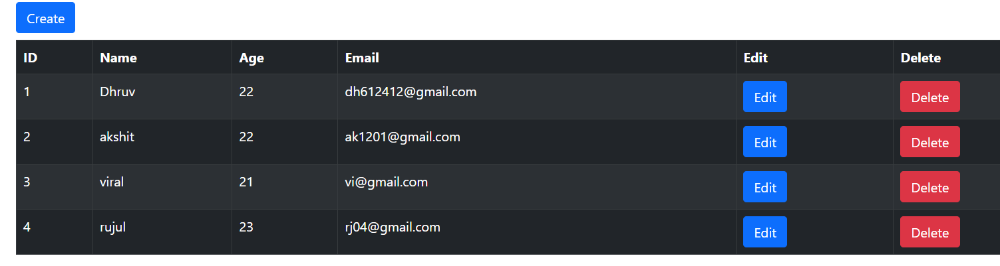

# CRUD-App-React

This is a CRUD (Create, Read, Update, Delete) application built with React. It utilizes Axios for API requests, React Router for routing, and Bootstrap for styling.

# Demo


## Features

- Create, Read, Update, and Delete (CRUD) operations.
- Responsive web design.
- Real-time data fetching and updating with Axios.
- Client-side routing with React Router.

## Technologies Used

- **React**: A JavaScript library for building user interfaces.
- **Bootstrap**: Front-end framework for developing responsive, mobile first projects on the web.

## Getting Started

### Prerequisites

Before running this project, make sure you have Node.js and npm (Node Package Manager) installed on your system.

### Installation

1. **Clone the repository**

   ```bash
   git clone https://github.com/your-repository/CRUD-App-React.git
   ```

2. **Install Dependencies**

   ```bash
   npm install
   ```

3. **Start Development Server**

   ```bash
   npm start
   ```


## License

This project is licensed under the MIT License - see the LICENSE.md file for details.

## Acknowledgments

- Thanks to [MockAPI](https://mockapi.io) for providing a platform to create mock APIs for testing and prototyping.
- Gratitude towards [React](https://reactjs.org/) for the efficient and flexible JavaScript library for building user interfaces.
- Appreciation for [Bootstrap](https://getbootstrap.com/) for its extensive library that helps in developing responsive and mobile-first websites quickly.
